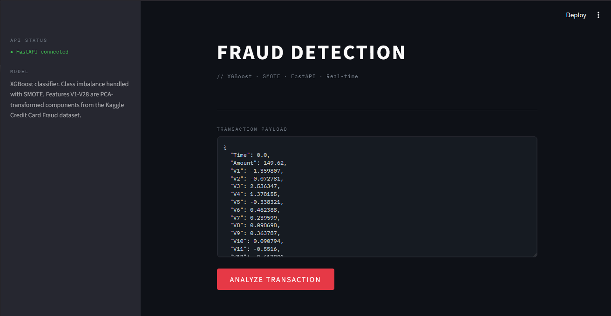

# Credit Card Fraud Detection

A machine learning system for real-time credit card fraud detection. Built with XGBoost and trained on the Kaggle Credit Card Fraud Detection dataset, the project handles extreme class imbalance using SMOTE and exposes predictions through a FastAPI REST endpoint with a Streamlit dashboard.


## Model Performance

Evaluated on a held-out test set of 56,962 transactions (20% of the full dataset).

| Metric | Score |
|---|---|
| AUC-ROC | 0.9808 |
| Recall (Fraud) | 0.8776 |
| Precision (Fraud) | 0.5733 |
| F1 Score (Fraud) | 0.6935 |
| Fraud Cases Caught | 86 / 98 |

**Confusion Matrix**

| | Predicted Legitimate | Predicted Fraud |
|---|---|---|
| Actually Legitimate | 56,800 | 64 |
| Actually Fraud | 12 | 86 |

Recall is prioritized over precision in this context. Missing real fraud (false negative) carries a higher cost than a false alarm (false positive), so the model is optimized to minimize missed fraud cases at the expense of some false alerts.

---

## Tech Stack

- **Model:** XGBoost Classifier
- **Imbalance Handling:** SMOTE (via imbalanced-learn)
- **Backend API:** FastAPI + Uvicorn
- **Frontend:** Streamlit
- **Data Processing:** Pandas, NumPy, Scikit-learn
- **Model Persistence:** Joblib


---

## Project Structure

```
fraud-detection/
├── main.py               # FastAPI backend — prediction endpoint
├── trainmodel.py         # Training pipeline — preprocessing, SMOTE, model training, evaluation
├── app.py                # Streamlit frontend dashboard
├── model_metrics.json    # Saved evaluation metrics from last training run
├── fraud_detection.log   # Training log output
├── creditcard.csv        # Dataset (not included — see Dataset section)
├── models/
│   ├── fraud_model_xgboost.pkl   # Trained XGBoost model
│   └── scaler.pkl                # Fitted StandardScaler
└── src/
    ├── config.py         # Paths, hyperparameters, constants
    └── features.py       # Feature engineering and scaling functions
```

---

## How It Works

### 1. Feature Engineering

Raw transaction data undergoes two transformations before training:

- `hour` — derived from the `Time` field (seconds elapsed since first transaction) using `floor(Time / 3600) % 24`. Captures time-of-day fraud patterns.
- `amount_log` — log1p transformation of the `Amount` field to reduce skew from large transaction outliers.

`Time` and `Amount` are dropped after these features are created. V1–V28 are pre-computed PCA components provided by the dataset.

### 2. Training Pipeline

The pipeline in `trainmodel.py` follows this exact order to prevent data leakage:

```
Load data
→ Feature engineering
→ Train/test split (80/20, stratified)
→ StandardScaler fit on training set only
→ SMOTE applied only to training set
→ XGBoost training
→ Evaluation on unmodified test set
→ Save model + scaler + metrics
```

SMOTE is applied after the train/test split deliberately — applying it before would allow synthetic fraud samples to leak into the test set, artificially inflating recall scores.

### 3. API Prediction Flow

```
POST /predict
→ Pydantic validation (Transaction schema)
→ Feature engineering on input
→ StandardScaler transform
→ XGBoost predict + predict_proba
→ JSON response: { is_fraud, fraud_probability_percent, status }
```

---

## Setup and Installation

### Prerequisites

- Python 3.9+
- The Kaggle Credit Card Fraud Detection dataset (see Dataset section)

### Install Dependencies

```bash
pip install -r requirements.txt
```

### Train the Model

Run this first before starting the API. Saves the trained model and scaler to the `models/` directory.

```bash
python trainmodel.py
```

### Start the FastAPI Backend

```bash
uvicorn main:app --reload
```

API will be available at `http://127.0.0.1:8000`
Swagger UI (interactive docs) at `http://127.0.0.1:8000/docs`

### Start the Streamlit Frontend

Open a second terminal and run:

```bash
streamlit run streamlitapp.py
```

Dashboard will open at `http://localhost:8501`

---

## API Reference

### POST /predict

Accepts a single transaction and returns a fraud prediction.

**Request Body**

```json
{
  "Time": 0.0,
  "Amount": 149.62,
  "V1": -1.359807,
  "V2": -0.072781,
  "V3": 2.536347,
  "V4": 1.378155,
  "V5": -0.338321,
  "V6": 0.462388,
  "V7": 0.239599,
  "V8": 0.098698,
  "V9": 0.363787,
  "V10": 0.090794,
  "V11": -0.551600,
  "V12": -0.617801,
  "V13": -0.991390,
  "V14": -0.311169,
  "V15": 1.468177,
  "V16": -0.470401,
  "V17": 0.207971,
  "V18": 0.025791,
  "V19": 0.403993,
  "V20": 0.251412,
  "V21": -0.018307,
  "V22": 0.277838,
  "V23": -0.110474,
  "V24": 0.066928,
  "V25": 0.128539,
  "V26": -0.189115,
  "V27": 0.133558,
  "V28": -0.021053
}
```

**Response**

```json
{
  "is_fraud": false,
  "fraud_probability_percent": 0.12,
  "status": "Transaction is Legitimate"
}
```

---

## Model Configuration

Defined in `src/config.py`:

```python
MODEL_PARAMS = {
    "n_estimators": 200,
    "max_depth": 5,
    "learning_rate": 0.1,
    "scale_pos_weight": 1,
    "n_jobs": -1,
    "random_state": 42
}
```

`scale_pos_weight` is set to 1 because SMOTE handles class balancing at the data level before training. Setting it higher alongside SMOTE would double-compensate for the imbalance.

---

## Dataset

This project uses the [Kaggle Credit Card Fraud Detection dataset](https://www.kaggle.com/datasets/mlg-ulb/creditcardfraud).

- 284,807 transactions, 492 fraud cases (0.17% of dataset)
- Features V1–V28 are PCA-transformed to protect cardholder confidentiality
- `Time`, `Amount`, and `Class` are the only non-PCA features

Download `creditcard.csv` from Kaggle and place it in the project root before running `trainmodel.py`. The file is not included in this repository due to its size.

---

## Requirements

```
fastapi
uvicorn
streamlit
pandas
numpy
scikit-learn
xgboost
imbalanced-learn
joblib
requests
```
